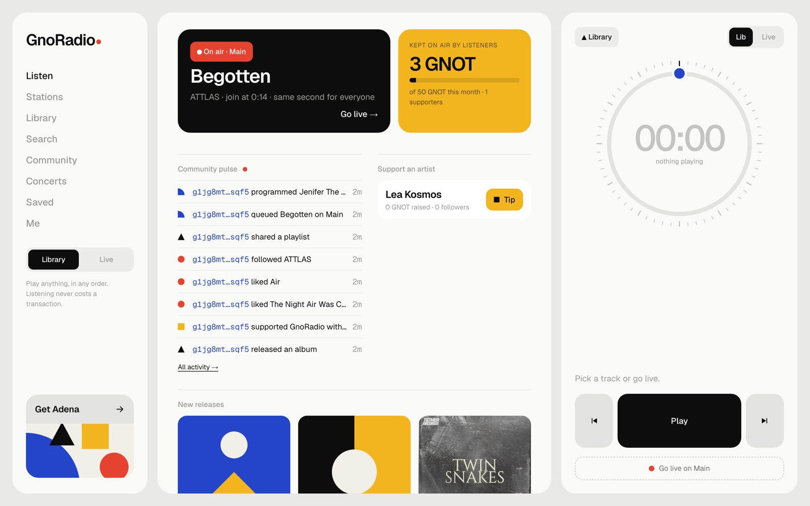

# GnoRadio



GnoRadio is a community radio and an open music player built on [gno.land](https://gno.land).

You can play any album or playlist on demand, or tune into one of the live stations. Everyone hears the same second at the same time, because the schedule lives on-chain. Listening is free and never needs a wallet.

The chain comes in when something matters. You can tip an artist, and 100% of the tip goes straight to their wallet. You can also put a track on air, follow someone, buy a concert ticket (an NFT), or chip in to keep the station running. Every one of these is a public transaction anyone can check.

The music comes from artists who publish their own tracks and from a hand-picked catalog of Creative Commons and Audius releases, each with proper credits.

## What's in here

- `gno/`: the realms (catalog, radio, tickets) and the gnoweb site
- `app/`: the web app (Vite, React, TypeScript)
- `tools/curate/`: the scripts used to pick the launch catalog
- `docs/`: the spec and the developer notes

## Try it locally

```sh
cd app && npm install && npm run dev
```

The app expects a local gno.land devnet running the realms. [docs/DEVELOPMENT.md](docs/DEVELOPMENT.md) explains how to start one, run the tests and deploy.

## Status

Early days. GnoRadio only runs on a local devnet for now, and nothing is live on a public network yet.
